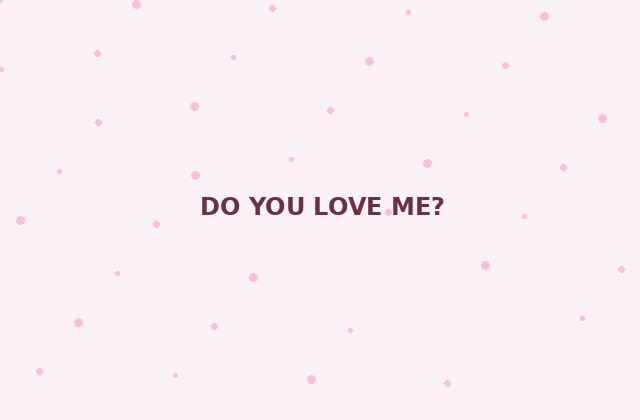

# 💗 Do You Love Me?

A playful, responsive **Do You Love Me?** mini web experience with a cheeky **No** button, animated hearts, and a cute celebration screen.

> Built for fun — simple HTML, CSS and JavaScript, with no framework or backend required.

## ✨ Highlights

- 💗 Cute glassmorphism-style UI
- 🏃 Playful moving **No** button
- 🎉 Animated celebration after clicking **Yes**
- 📱 Responsive on mobile and desktop
- ⚡ Zero dependencies at runtime
- 🎞️ Original lightweight GIF assets included locally
- ♿ Meaningful image alt text and keyboard-friendly buttons

## 🎬 Demo

Open `index.html` in a browser.

For GitHub, the included GIFs can also be shown directly in this README:

<p align="center">
  
</p>

## 📁 Project Structure

```text
Fun_DoYouLoveMe/
├── assets/
│   ├── heart-loading.gif
│   ├── love-celebration.gif
│   └── love-sparkles.gif
├── do_you_love_me.css
├── do_you_love_me.js
├── index.html
├── LICENSE
└── README.md
```

## 🚀 Run Locally

No build step is needed.

```bash
git clone https://github.com/MarzzzSiam/Fun_DoYouLoveMe.git
cd Fun_DoYouLoveMe
```

Then open `index.html`.

For a local server:

```bash
python -m http.server 5500
```

Open `http://localhost:5500`.

## 🌐 Deploy with GitHub Pages

1. Push the project to a GitHub repository.
2. Go to **Settings → Pages**.
3. Select **Deploy from a branch**.
4. Choose `main` and `/ (root)`.
5. Save and wait for GitHub Pages to publish.

## 🛠️ Customize

Change the main question in `index.html`:

```html
<h1>Do you love me?</h1>
```

Change the colors in `do_you_love_me.css`:

```css
:root {
  --pink: #f44f7a;
  --deep: #6b3046;
}
```

Change the final message:

```html
<h2>I knew it!</h2>
<p class="subtitle">You officially passed the love test.</p>
```

## 🎞️ GIFs

The included GIFs are generated for this project and stored locally, so the README does not depend on an external GIF host. GitHub renders repository GIFs directly in Markdown. Keeping short GIFs reasonably small also helps README loading performance. citeturn0search1turn0search8

## 📄 License

This version is supplied with an MIT license. If you are publishing a derivative of another person's repository, keep the original project's attribution and check its existing license before redistributing modified code. GitHub notes that without a license, default copyright rules apply. citeturn0search2
